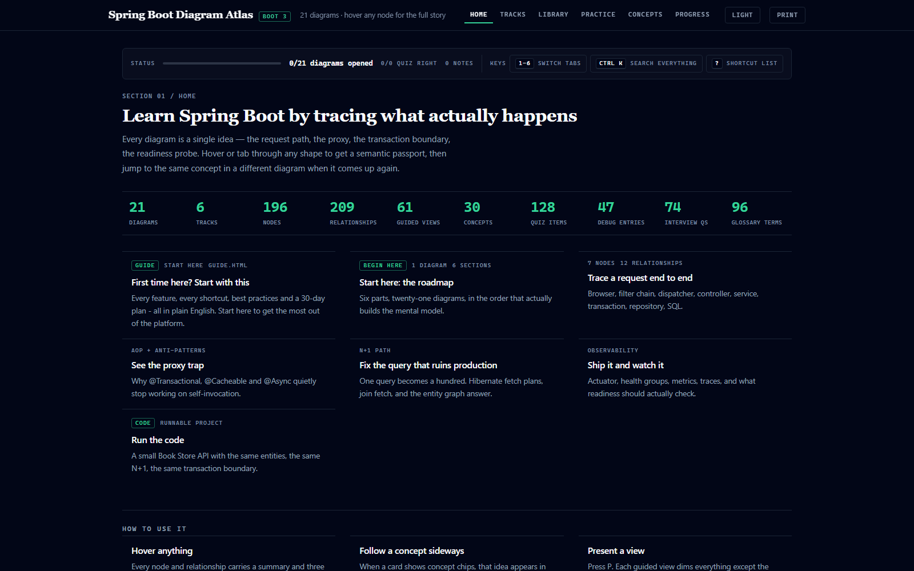
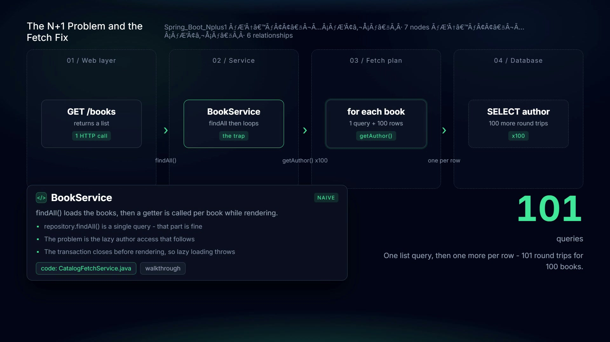
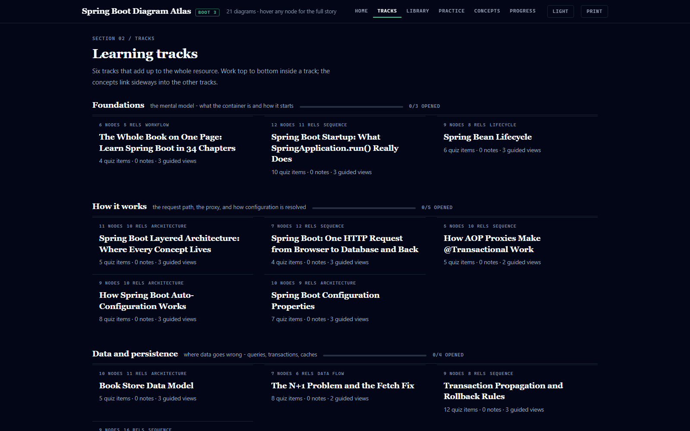
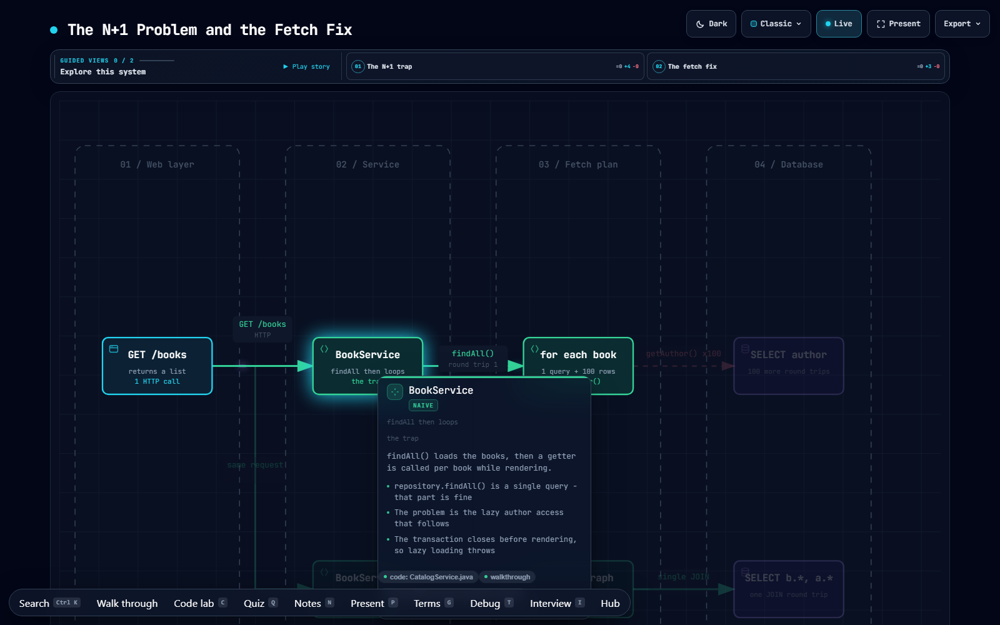
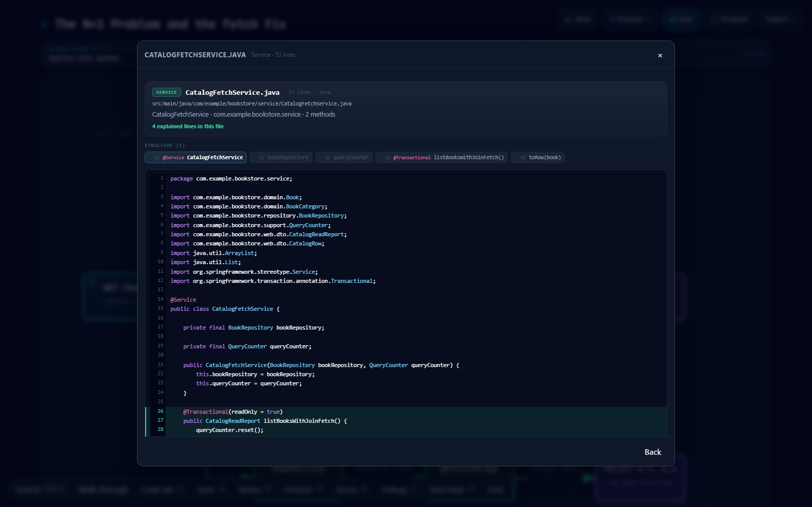
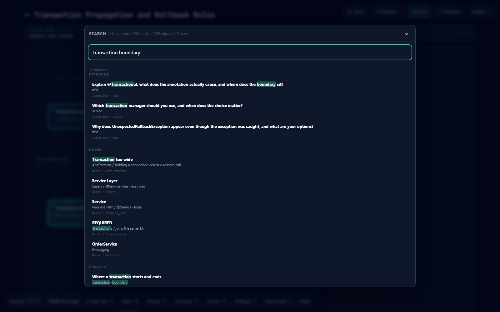
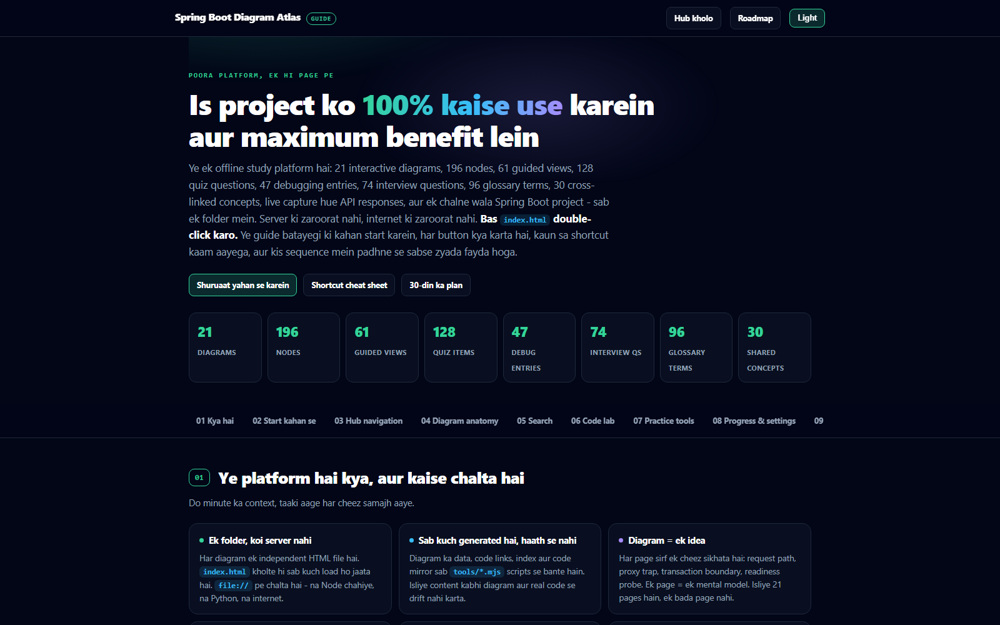

<div align="center">

# Spring Boot Diagram Atlas

**You have read the docs. Now watch it happen.**

21 interactive diagrams that follow one real request through a real Spring Boot
application — the container, the proxy, the transaction boundary, the hundred
queries — and then open the actual source file behind it.

No install. No server. No internet. Just double-click `index.html`.

[](https://spring.io/projects/spring-boot)
[](#whats-inside)
[](#what-you-can-do-with-it)
[](#what-is-this)

[**Open the hub**](index.html) · [**How to use this**](guide.html) · [Notes (docx)](Spring_Boot_Complete_Notes.docx)



</div>

---

<a id="watch"></a>
## See it in 21 seconds

One innocent `GET /books`, the hundred queries it is hiding, the real file
behind it, and what is in the folder — set to music, no narration to wait
through.

[](brag-output/brag.mp4)

**[Play the film](brag-output/brag.mp4)** · 1920 × 1080 · 21.5 s · sound on

---

<a id="what-is-this"></a>
## What is this?

A folder of HTML files that teaches Spring Boot **by tracing it**, not by
describing it.

Each diagram is one idea — *where a request actually goes*, *why your
`@Transactional` silently stopped working*, *how one query becomes a hundred*.
You hover any shape and get a "passport": what it is, why it exists, and the
gotcha that bites people in production. Every concept links sideways into the
same idea showing up in a different diagram, and down into the real Java file
that implements it.

It runs entirely from `file://`. There is nothing to `npm install`, no Docker,
no database to stand up.

---

<a id="who-its-for"></a>
## Who it is for

| If you are… | This is for you because |
|---|---|
| **Learning Spring Boot** | You get the mental model first, in the order that actually builds one — Foundations → How it works → Data → Security → Running it → Hardening. |
| **Debugging something weird** | 47 symptom-first entries keyed on the error text you actually see in your console, each with the cause and the fix. |
| **Preparing for interviews** | 154 questions with model answers, plus a quiz attached to every diagram so you find out what you forgot. |
| **Teaching or onboarding** | Present mode (`P`) opens a stage: the diagram fills the screen under a moving light while a rail on the right carries the narration, one view at a time; the whole thing is one folder you can hand someone. |
| **Tired of prose** | 96 glossary terms and 30 shared concept cards you can jump to from anywhere — no more re-scrolling a 40-page article. |

---

<a id="what-you-can-do-with-it"></a>
## What you can do with it

**Trace a request end to end.** Browser → filter chain → dispatcher → controller →
service → transaction → repository → SQL, as one diagram you can step through.

**Be shown around once.** Every page introduces itself the first time you open
it — a spotlight card that points at the toolbar, the passport and the shortcuts,
one stop at a time, with a *Skip tour* link in the corner. It remembers, per
page, that you have seen it.

**Hover for the semantic passport.** Every node and relationship carries a
summary and three specific points — not "a service handles business logic", but
"`findAll()` loads the books, then a getter is called per book while rendering".

**Follow a concept sideways.** The transaction boundary is one card here and the
same card on the AOP page. Click the chip, land on the other angle.

**Open the real source.** `C` (or the *code lab* chip in a passport) opens the
mirrored Book Store file — 48 files, 3,732 lines, byte-for-byte from the app.

**See measured numbers, not made-up ones.** Responses in the diagrams were
captured from the running application: real query counts, real timings.

**Test yourself.** 315 quiz items, 47 debug entries, 154 interview questions, 96
glossary terms — all searchable in one keystroke. Miss a question and the
review queue brings it back after a day, then three, then seven.

---

<a id="tour"></a>
## A 60-second tour

### 1 · Pick a track

Six tracks in the order that actually builds the mental model.



### 2 · Hover anything

This is the whole product in one frame. The node is `BookService`; the card
tells you it is **naive**, what it does, and the three things that go wrong —
with a jump straight to the code and the walkthrough.



### 3 · Jump to the actual Java

No "imagine you have a service class". The mirrored source, with the structure
outline and the explained lines marked.



### 4 · Find anything with one keystroke

`Ctrl+K` searches across diagrams, nodes, relationships, concepts, glossary,
debug entries and interview questions at once.



### 5 · New here? Read the guide first

Fourteen sections in plain English — which button does what, every
shortcut, best practices, and a 30-day plan.



---

<a id="whats-inside"></a>
## What's inside

| | |
|---|---|
| Interactive diagrams | **21** across **6** learning tracks |
| Nodes · relationships · guided views | **196** · **209** · **61** |
| Quiz items | **315** |
| Review queue | wrong answers return after **1 / 3 / 7 days** |
| Debug / troubleshooting entries | **47** |
| Interview questions with answers | **154** |
| Glossary terms | **96** |
| Shared concept cards | **30** |
| Mirrored source files in the code viewer | **48** files · **3,732** lines |
| Companion app tests | **15 / 15** |

### The six tracks

| Track | It covers | Diagrams |
|---|---|---|
| **Foundations** | the mental model — what the container is and how it starts | Roadmap · Startup · Bean Lifecycle |
| **How it works** | the request path, the proxy, and how configuration is resolved | Layers · Request Path · AOP Proxy · Auto-Configuration · Config Properties |
| **Data and persistence** | where data goes wrong — queries, transactions, caches | Data Model · N+1 · Transactions · Caching |
| **Security** | authentication, authorization, and the filter chain | Security JWT |
| **Running it** | observability, background work, messaging, deployment | Observability · Async & Scheduling · Messaging · Deployment |
| **Hardening** | testing, the traps that reach production, the upgrade path | Testing Slices · Anti-Patterns · WebFlux · Migration 2→3 |

---

<a id="get-started"></a>
## Getting started

```bash
git clone <your-repo-url>
start index.html        # Windows — or just double-click it
```

That is the entire setup. Then:

1. **Let the tour run.** The first time you open any page — the hub, the guide,
   or one of the 21 diagrams — a spotlight walks you through that page in under
   a minute: what the buttons do, where the shortcuts are. Skip it whenever you
   like; press `U` or the *Tour* button to run it again.
2. **Read [guide.html](guide.html)** — 10 minutes, and you will know every button.
3. **Open the roadmap** from *Tracks* and work top to bottom inside a track.
4. **Hover instead of reading.** If a card says `walkthrough`, take it — that is
   the same material as a step-by-step trace through the code.
5. **Press `P` when you want the short version** of a diagram, `C` for the code,
   `Q` to check yourself.
6. **Press `?` any time.** You will not break anything.

### Keyboard

| Key | Opens |
|---|---|
| `Ctrl` / `Cmd` + `K` | Search — everything at once |
| `Q` · `R` · `P` · `C` | Quiz · Review queue · Present mode · Code lab |
| `G` · `T` · `I` | Glossary · Debug by symptom · Interview bank |
| `?` · `Esc` | Help · close whatever is open |
| `U` | Tour — the walk through this page, again |
| `1` – `6` | Hub tabs |
| `→` `Space` `←` | Step through Present mode (`Home` / `End` jump to the ends) |
| `Tab` | Move between nodes — the passport follows |

---

<a id="bookstore"></a>
## The code is real, and you can run it

The source in the code lab is not a snippet in a blog post. `bookstore/` is a
**Spring Boot 3.3.5 / Java 17** application with 15 passing tests, and it ships
both the broken and the fixed version of every mistake the diagrams teach:

```text
GET  /api/catalog/books/naive          ← the N+1, on purpose
GET  /api/catalog/books/join-fetch     ← the fix
POST /api/catalog/categories/stale     ← lazy-loading across a transaction boundary
POST /api/orders                       ← order placement inside one transaction
GET  /api/outbox/pending|handled       ← transactional outbox state
GET  /api/system/transaction-probe     ← what @Transactional actually did
GET  /api/system/precedence-layers     ← config property precedence, measured
```

```bash
cd bookstore
.\run.cmd        # start on :8080 (kills any stale listener first)
.\test.cmd       # 15 tests: WebMvc, DataJPA, transaction, outbox
```

Both scripts use `mvn` when it is on your `PATH` and fall back to the committed
Maven Wrapper, so a clean checkout builds with nothing but Java installed.

---

<a id="why-different"></a>
## Why not just read the docs?

| Documentation says | This shows |
|---|---|
| "Use `JOIN FETCH` to avoid the N+1 problem" | One diagram where a single query becomes a hundred, with the measured count on the arrow, and the join-fetch version side by side |
| "`@Transactional` is proxy-based" | The proxy node, the self-invocation edge that skips it, and the exact `CatalogFetchService.java` line |
| "Transactional outbox guarantees at-least-once" | The outbox table, the relay, the pending → handled state, in the running app |
| "Configuration properties have an order of precedence" | `GET /api/system/precedence-layers` returning the actual layers, captured |

---

<a id="internals"></a>
## For people who want to change it

Everything under `docs/screenshots/` and `brag-output/` is generated or
captured — the diagrams and data are the source of truth.

```bash
node tools/capture-evidence.mjs     # 1. boot the app, record real responses  → evidence.js
node tools/build-traces.mjs         # 2. evidence → walkthrough steps
node tools/build-code-viewer.mjs    # 3. mirror bookstore/** → code-source.js
node tools/build-content-index.mjs  # 4. all content → content-index.js
node tools/enhance-hover.mjs        # 5. stamp the 21 diagrams with hover passports
```

Do not hand-edit `evidence.js`, `code-source.js`, `content-index.js`, or the 21
base diagram files — step 5 rewrites them.

| Check | Command | Expected |
|---|---|---|
| Links, anchors, staleness | `node tools/audit-links.mjs` | 48 mirrored · 0 stale |
| Hub, guide, practice flows | `node tools/probe-hub.mjs` | 4 / 4 |
| Hover passports | `node tools/probe-hover.mjs` | 21 / 21 |
| Source viewer / code lab | `node tools/probe-code-viewer.mjs` · `probe-code-lab.mjs` | 34/34 · 30/30 |
| Shared kit, deep links | `node tools/probe-kit.mjs` | 5 / 5 |
| First-visit tour | `node tools/probe-tour.mjs` | 40 / 40 |
| App tests | `bookstore\test.cmd` | 15 / 15 |

The probes drive a real Chrome over CDP, so they fail when the page actually
breaks rather than when a string changes.

### Re-rendering the film

```bash
cd brag-output/composition
npm run check     # lint · runtime · layout · motion · contrast
npm run render    # → renders/*.mp4, 21.5 s, 1920 × 1080, music baked in
```

The composition is one paused GSAP timeline on `window.__timelines["brag"]`.
Its top and bottom bloom is driven by a precomputed RMS lane of the soundtrack,
so every frame is still deterministic — seek to any time and you get the same
picture.

---

<a id="layout"></a>
## Repository map

```text
index.html  hub.js                  the hub: tracks, library, practice, progress
guide.html                          plain-English guide — start here if you are new
sbkit.js  sbkit.css                 the shared kit: passport, panels, code lab
Spring_Boot_*.html                  21 diagrams, self-contained
content-index.js  code-source.js    generated: search index, 48 mirrored files
evidence.js  concepts.js            generated: measured responses, 30 concept cards
study-data.js                       315 quiz · 47 debug · 154 interview · 96 glossary
bookstore/                          the runnable Spring Boot 3.3.5 companion app
tools/                              5 builders · 5 probes · 1 audit
docs/screenshots/                   the images used in this README
brag-output/                        the 21-second film, its poster, and the composition
```

---

<a id="docs"></a>
## Documentation

- **[guide.html](guide.html)** — how to use every feature, in plain English. Start here.
- **[bookstore/README.md](bookstore/README.md)** — how the companion app maps to
  diagram node-ids, and how to regenerate the assets.
- **[Spring_Boot_Complete_Notes.docx](Spring_Boot_Complete_Notes.docx)** — the same
  material as a printable document.

---

<div align="center">

Open a diagram · hover a node · take the walkthrough · get asked about it.

</div>
